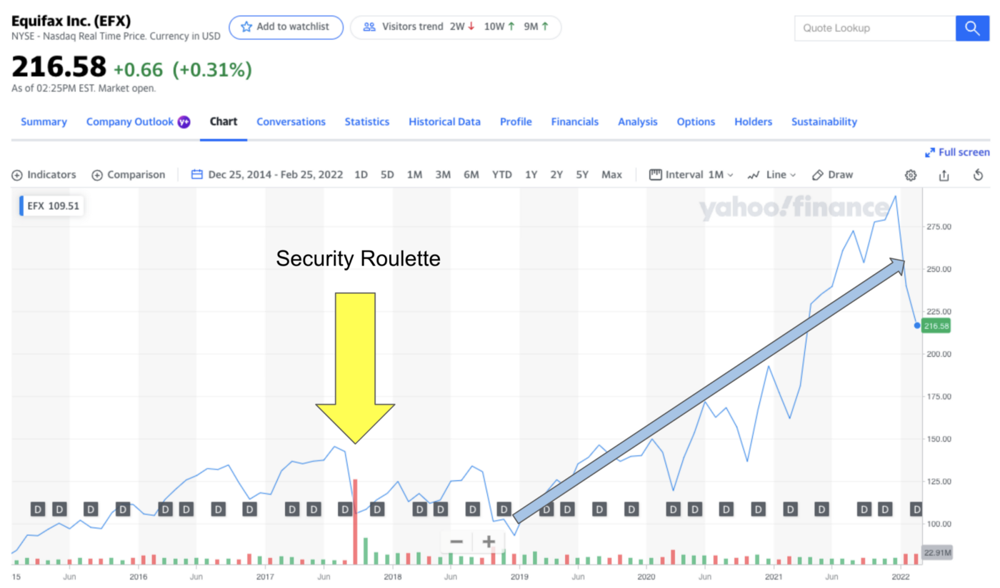
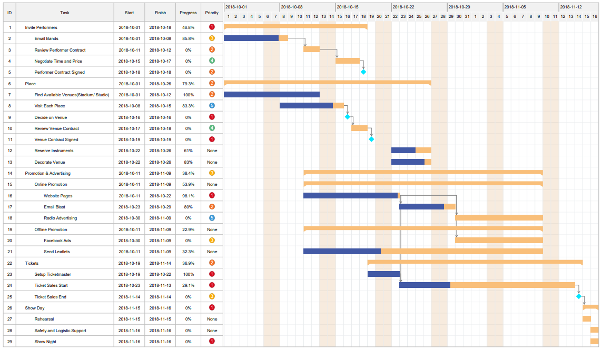
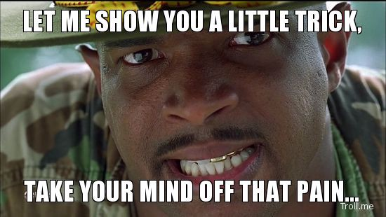

{}

{}

**Contributed by:** [Alex Herweyer](https://medium.com/@alexherweyer/the-managers-guide-to-slowly-killing-your-org-31b5768ac1d5), [SAD Accredited Facilitator](/certifications/advanced-certifications/#scaled-agile-dev-ops-accredited-facilitators)

Being a people leader in a large company can be exhausting. Often times it seems like the entire system is working against you. There is good news and bad news. The bad news is that, yes, the systems in large organizations are stacked against you. The good news is that these systems can be exploited for your own personal gain!

This guide is intended to help you navigate decision-making and hone your focus to optimize career growth, at the expense of those who work for you and the company itself. Enjoy!

### Stamp out variability — standardize, standardize, standardize

**Guiding principle:** *Assuming everything is knowable and hold others accountable to knowing everything up-front*

[About the Cynefin Framework](https://thecynefin.co/about-us/about-cynefin-framework/)

The basic premise and world-view you must adopt is that with enough planning and forethought, all risks can be addressed. You also understand the end state of what you are trying to achieve well enough to make a detailed plan to get there.

When you have this mindset, any sort of redundant system is waste. Using economies of scale and cost savings models, you can easily shut down arguments from naysayers. With this principle and mindset, you can drive your organization towards one way of doing thing and then leaning it out.

When considering new ideas, only work on the things you are certain will succeed. The greater the unknowns, the less upfront planning you can do. This means you have no way to estimate the cost of the effort, nor the payback for the work. Avoiding uncertainty makes you look good and is easy to justify to leadership and those reporting to you.

### Focus on efficiency — pretend that nothing changes and optimize for the current state

**Guiding principle:** *Efficiency is always good. ALWAYS!*

Efficiency and cost reduction are easy to justify, as it has a quick impact on profitability. As a manager, focusing on near-term efficiency is the right move, every time.

The best example of this is the Equifax breach. The upper leadership chose to cut security spending and keep spending low. This improved their profit margin for years. With stock options, these near-term profit improvements paid off. Investments in things like cyber security is an investment in resiliency. These sorts of investments negatively impact profit margins, so make sure to avoid them.

If the stock graph above makes anything clear, it's that ignoring security for years pays off in the end, even if your bet turns sour for a little while.

Another thing to avoid is flexibility in the solutions you build. Building in flexibility allows things to be changed later… after you've moved on to another job. The manager replacing you will get all the credit for adapting to market changes, not you. It's better to build to suit and save money now than to build something that will work in perpetuity. Why build something that lasts more than a few years anyways? Whatever you are putting into place will be replaced, right?

### Setting up your team for a death march — managing to initial estimates with 100% capacity utilization baked into plan

**Guiding principle:** *Use early estimates to guide delivery dates to keeps everyone focused*

When building software, setting your team up for a death march is the best way to look like a competent leader. The first step is to require estimates for all the work necessary to get things done. Make sure to emphasize that these are only estimates, and people will not be held to them. Once you have estimates for your years-long project in place, create a schedule with a targeted end date. Build-in 20% extra for contingency… DONE! You've now setup your team for a death march.

Execution is key though. Make sure that the team is focusing their time on the easy things first. You don't tell the team that, of course. Rather, ask them for weekly status updates and insist that they stay on schedule. The team will naturally focus on those things with the least amount of unknowns. By doing this, you and the team will be saving the hard things for the end, with good progress in the first two-thirds of the original timeline.

Now comes the death march! With all the low-risk items complete, insist on meeting the original schedule. Using project management techniques, cut scope and reduce quality. Make sure to require overtime, take shortcuts, and hardcode integrations at the end in order to ship.

Once you've completed the project, celebrate it. You've earned it.

### Yes by a thousand cuts — letting the friction in the system stop things

**Guiding principle:** *The system will stop everything that wasn't supposed to happen*

Telling people 'no' is uncomfortable. Often new and exciting ideas will be presented to you and you'll need to deal with these somehow. This is when leaning into the bureaucracy comes in handy. Anyone that works in a company that has been around more than a decade knows that there is a confusing and conflicting maze of rules. These rules make it nearly impossible to get work done, especially when doing something new. What should you do when someone asks for permission to pursue the idea? Just say yes and let the system stop them!

Using this approach is pretty straightforward. If the idea is actually compelling and whoever is driving it succeeds, you can claim credit for green-lighting it. The more likely scenario is that the effort will stall out, at which point, you can shrug it off.

### The zen of org charts — functions, job roles, and hierarchy are always to blame

**Guiding principle:** *It's impossible to prove it's not the org chart causing issues, so change it!*

The problem you face is an org chart problem. At some point, a leader before you made decisions about how things should operate and built an org chart to match their vision. These decisions were made using incomplete information and done in great secrecy. Changing things with a re-design will inevitably make some things better.

Because making org changes is very stress-inducing, it's important to involve as few people as possible and to plan the org re-design in secrecy. Focus on your current problem set to be addressed. Once you have a good vision for how you think things should operate, make the necessary org chart to match your vision.

Voilà! The problems you had been facing will no longer be your highest order issues.

### Focus on what's wrong with individual performance — allot most of your attention to poor performers

**Guiding principle:** *Problem people are the problem*

The bureaucracy in organizations requires annual reviews of individuals. By letting high performers "do their thing", you are getting out of people's way. Simply check in with high performers once a year and give them high marks. One caveat is to always listen to high performers when they give suggestions. If a high performer has an idea, make sure to support it.

However, the majority of your time should be spent focusing on low performers. This helps your team's morale. They will see that you care about low performers and how they are impacting everyone. Make sure to dismiss suggestions from low performers- they haven't 'earned' the right to be heard.

### Emphasize cost concerns at every opportunity

**Guiding principle:** *Accountants provide the only numbers that matter*

Measuring the value your team provides is very difficult. That is why you should stop trying to measure value. Your focus should be on costs: ensure that your actuals ALWAYS hit the forecast.

The main thing that every executive sees each month is the financial reports provided by the finance department. There are three basic elements to the finance report: Budget, forecast, and actuals. The budget is the guess you made at the beginning of the planning period. This was before you knew what your team should focus on. Never admit that! The budget is correct and you were correct when you guessed it. With the little bit of time you have outside focusing on low performers, make sure to keep a close eye on all your costs. No one ever gets in trouble for getting their actuals to align perfectly with budget and forecast.

### Conclusion

Using the risk-averse systems within your company is the easiest path to a moderately fulfilling career. Use these 7 principles to skirt responsibility and climb the corporate ladder. Make sure to pass this wisdom to the next generation. By doing so, you ensure the next generation of thought workers will have the same garden to grow in.

1. Assuming everything is knowable and hold others accountable to knowing everything up-front ([anti-pattern to avoid](https://www.huffpost.com/entry/exploit-variability-dont-_b_8650050))
2. Efficiency is always good. ALWAYS! ([anti-pattern to avoid](https://www.google.com/books/edition/Software_Engineering_at_Google/WXTTDwAAQBAJ?hl=en&gbpv=1&printsec=frontcover))
3. Use early estimates to guide delivery dates to keeps everyone focused ([anti-pattern to avoid](https://medium.com/mindsea-development-inc/why-your-rat-riskiest-assumption-test-is-the-real-mvp-177d66cde3e1))
4. The system will stop everything that wasn't supposed to happen ([anti-pattern 1](https://d-pereira.com/mastering-the-art-of-saying-no/) and [anti-pattern 2](https://itrevolution.com/delicate-art-of-bureaucracy/) to avoid)
5. It's impossible to prove it's not the org chart causing issues, so change it! ([anti-pattern to avoid](https://teamtopologies.com/))
6. Problem people are the problem ([anti-pattern 1](https://www.blameless.com/sre/why-companies-can-benefit-from-blameless-culture) and [anti-pattern 2](https://www.mckinsey.com/business-functions/people-and-organizational-performance/our-insights/the-organization-blog/from-me-to-we-the-next-shift-in-performance-management) to avoid)
7. Accountants provide the only numbers that matter ([anti-pattern to avoid](https://blackswanfarming.com/))
